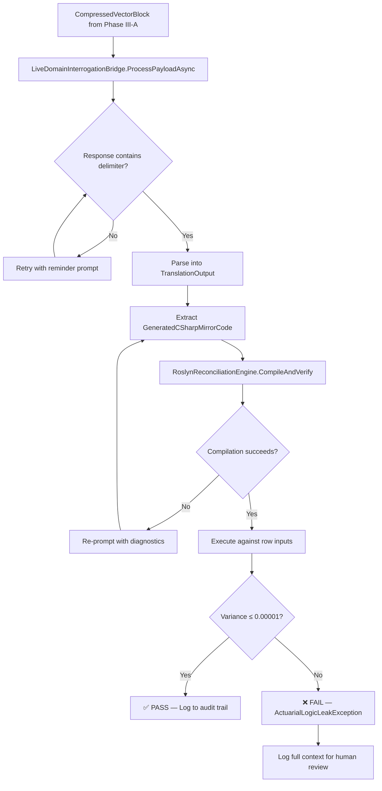

# Phase III-B Architecture Diagrams

## Reconciliation Loop Orchestration

The full Phase III-B pipeline for a single `CompressedVectorBlock`:

```mermaid
flowchart TD
    A[CompressedVectorBlock from Phase III-A] --> B[LiveDomainInterrogationBridge.ProcessPayloadAsync]
    B --> C{Response contains delimiter?}
    C -->|No| D[Retry with reminder prompt]
    D --> C
    C -->|Yes| E[Parse into TranslationOutput]
    E --> F[Extract GeneratedCSharpMirrorCode]
    F --> G[RoslynReconciliationEngine.CompileAndVerify]
    G --> H{Compilation succeeds?}
    H -->|No| I[Re-prompt with diagnostics]
    I --> F
    H -->|Yes| J[Execute against row inputs]
    J --> K{Variance ≤ 0.00001?}
    K -->|Yes| L[✅ PASS — Log to audit trail]
    K -->|No| M[❌ FAIL — ActuarialLogicLeakException]
    M --> N[Log full context for human review]
```
