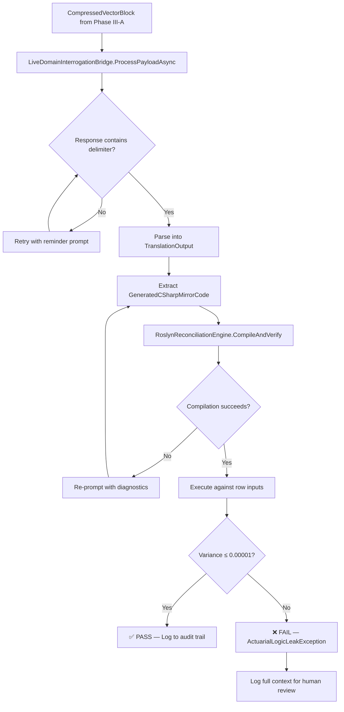

# Phase III-B: Live Bridge & Reconciliation — Detailed Design & Assumptions

This document expands the `enterprise-lifecycle-spec.md` Phase III-B section by specifying the live LLM bridge implementation, the prompt template structure, the response-to-C# compilation pipeline, and the error recovery strategy.

> [!CAUTION]
> **Ground Truth Verification Mandate applies.** The prompt template documented here is derived from the validated Phase I Codestral interaction logged in `docs/governance/master-prompt-engineering-log.md`. Any future prompt modifications must be regression-tested against the same baseline payload before deployment.

---

## 1. Live Bridge Implementation

### Swapping Mock → Live

The `IDomainInterrogationBridge` interface remains unchanged. The swap is purely a DI registration change:

```csharp
// Phase II (tests):
services.AddSingleton<IDomainInterrogationBridge, MockDomainInterrogationBridge>();

// Phase III-B (live):
services.AddSingleton<IDomainInterrogationBridge, LiveDomainInterrogationBridge>();
```

### `LiveDomainInterrogationBridge` Contract

```csharp
namespace ActuarialTranslationEngine.Engine.Bridges
{
    using System;
    using System.Net.Http;
    using System.Net.Http.Headers;
    using System.Net.Http.Json;
    using System.Text.Json;
    using System.Threading.Tasks;
    using ActuarialTranslationEngine.Core.Interfaces;
    using ActuarialTranslationEngine.Core.Models;

    public class LiveDomainInterrogationBridge : IDomainInterrogationBridge
    {
        private readonly HttpClient _httpClient;
        private readonly string _endpointUrl;
        private readonly string _modelName;
        private readonly string _systemPrompt;

        public LiveDomainInterrogationBridge(HttpClient httpClient, LlmBridgeConfiguration config)
        {
            _httpClient = httpClient;
            _endpointUrl = config.EndpointUrl;
            _modelName = config.ModelName;
            _systemPrompt = config.SystemPrompt;

            _httpClient.DefaultRequestHeaders.Authorization =
                new AuthenticationHeaderValue("Bearer", config.ApiKey);
        }

        public async Task<TranslationOutput> ProcessPayloadAsync(CompressedVectorBlock payload)
        {
            string userPayload = JsonSerializer.Serialize(payload);

            var response = await _httpClient.PostAsJsonAsync(_endpointUrl, new
            {
                model = _modelName,
                messages = new[]
                {
                    new { role = "system", content = _systemPrompt },
                    new { role = "user", content = userPayload }
                },
                temperature = 0.0  // Deterministic output for reproducibility
            });

            string responseContent = await response.Content.ReadAsStringAsync();

            if (!response.IsSuccessStatusCode)
            {
                throw new ActuarialLlmBridgeException(
                    $"LLM API returned {response.StatusCode}: {responseContent}");
            }

            // Parse the OpenAI-compatible response envelope
            using var document = JsonDocument.Parse(responseContent);
            var root = document.RootElement;
            string content = root
                .GetProperty("choices")[0]
                .GetProperty("message")
                .GetProperty("content")
                .GetString()
                ?? throw new ActuarialLlmBridgeException("LLM returned null content.");

            return ParseLlmContentToTranslationOutput(content);
        }
    }
}
```

### Configuration Model

```csharp
public class LlmBridgeConfiguration
{
    public string EndpointUrl { get; set; } = "https://openrouter.ai/api/v1/chat/completions";
    public string ModelName { get; set; } = "mistralai/codestral-2508";
    public string ApiKey { get; set; } = string.Empty; // Injected from env/secret manager
    public string SystemPrompt { get; set; } = string.Empty; // Loaded from governance file
    public int MaxRetries { get; set; } = 3;
    public int RetryDelayMs { get; set; } = 2000;
}
```

---

## 2. Prompt Template Specification

### System Prompt (Production Version)

The Phase I spike used a minimal prompt. The production prompt must be significantly more structured to ensure the LLM generates compilable C# rather than freeform text.

```text
You are a Senior Actuarial Engineer. You will receive a JSON payload representing a compressed 
vector block extracted from an actuarial spreadsheet.

Your task is to produce TWO outputs, separated by the delimiter "===CSHARP_MIRROR===":

PART 1 — ACTUARIAL SPECIFICATION (Markdown):
Write a concise specification of the financial rules expressed by the formulas in the payload.
Map each column to its standard actuarial term. Identify the product framework 
(e.g., Universal Life, Term Life, Deferred Annuity, GAAP Reserve).

PART 2 — C# MIRROR CODE:
Generate a single C# class that implements the interface:
  IActuarialReconciliationUnit { decimal ExecuteCalculationRow(Dictionary<string, decimal> inputs); }

Rules for the C# code:
- The class MUST be named "DynamicReconciliationUnit".
- The class MUST implement IActuarialReconciliationUnit.
- The method receives a dictionary where keys are column letters (e.g., "K", "L").
- The method must return the calculated value for the TARGET column.
- Use only System and System.Collections.Generic namespaces.
- Do NOT use any external libraries.
- Do NOT include namespace declarations or using statements in your output.
- Output ONLY the class definition, nothing else.
- Ensure your generated class handles financial values using the decimal type natively, and all probability vectors using the double type, avoiding implicit cast violations inside the dynamic loop.
```

### Response Parsing Logic

The `ParseLlmContentToTranslationOutput` method splits the LLM response on the `===CSHARP_MIRROR===` delimiter:

```csharp
private TranslationOutput ParseLlmContentToTranslationOutput(string content)
{
    const string delimiter = "===CSHARP_MIRROR===";
    int splitIndex = content.IndexOf(delimiter, StringComparison.Ordinal);

    if (splitIndex < 0)
    {
        throw new ActuarialLlmBridgeException(
            "LLM response did not contain the required ===CSHARP_MIRROR=== delimiter. " +
            "The prompt may need revision or the model may have deviated from instructions.");
    }

    return new TranslationOutput
    {
        FinalAuditableMarkdown = content[..splitIndex].Trim(),
        GeneratedCSharpMirrorCode = WrapInCompilableUnit(content[(splitIndex + delimiter.Length)..].Trim())
    };
}

private string WrapInCompilableUnit(string rawClassBody)
{
    // The LLM outputs only the class body. We wrap it with the required using statements
    // and namespace to make it compilable by Roslyn.
    return $"""
        using System;
        using System.Collections.Generic;
        using ActuarialTranslationEngine.Core.Interfaces;

        {rawClassBody}
        """;
}
```

---

## 3. Error Recovery & Retry Strategy

### Failure Modes

| Failure | Detection | Recovery |
|---------|-----------|----------|
| **Network timeout** | `TaskCanceledException` | Retry up to `MaxRetries` with exponential backoff (`RetryDelayMs * 2^attempt`) |
| **Rate limited (429)** | `HttpStatusCode.TooManyRequests` | Extract `Retry-After` header; wait that duration; retry |
| **LLM returns non-compilable C#** | Roslyn `Emit` fails with diagnostics | Re-prompt the LLM with the compilation errors appended to the user message (see §3.1) |
| **LLM omits delimiter** | `IndexOf` returns -1 | Retry once with an explicit reminder appended: `"IMPORTANT: You must include ===CSHARP_MIRROR=== between the two sections."` |
| **LLM hallucinates extra namespaces** | Roslyn compilation succeeds but `GetType("DynamicReconciliationUnit")` returns null | Strip all `namespace` declarations from the C# output and retry compilation |
| **Mathematical variance exceeds threshold** | `ActuarialLogicLeakException` | Log the failure with full context (inputs, expected, actual). Do NOT retry — this indicates a genuine semantic misunderstanding by the LLM that requires human review. |

### 3.1 Compilation Error Re-Prompting

When Roslyn fails to compile the LLM's C# output, the system constructs a repair prompt:

```text
The C# code you generated failed to compile with the following errors:
{diagnosticErrors}

Please fix the code and output ONLY the corrected class definition.
The class must be named "DynamicReconciliationUnit" and implement IActuarialReconciliationUnit.
```

This repair loop runs a maximum of 2 additional attempts. If compilation still fails after 3 total attempts (1 original + 2 repairs), the system throws `ActuarialDynamicCompilationException` and moves to the next payload.

---

## 4. Reconciliation Loop Orchestration

The full Phase III-B pipeline for a single `CompressedVectorBlock`:



### Per-Partition Execution

The reconciliation engine processes each `VectorRangePartition` independently:

1. Select a **representative row** from the partition (default: `StartRow + 1` to avoid seed rows).
   * **Structural Error Suppression:** If the chosen representative verification row references any cell marked with an anomaly exception flag inside the `DisruptiveNodes` collection, the engine must step down the sequence and automatically bind its validation loop to the next structurally clean row within that partition block layout.
2. Build the `Dictionary<string, decimal> rowInputs` from the `RawWorkbookMap` for that row.
3. Set `expectedSpreadsheetResult` to the evaluated value of the TARGET column for that row.
4. Invoke the compilation and verification pipeline.
5. If the partition passes, mark it as verified. If it fails, the entire block is flagged.

### ~~Why Only One Representative Row?~~ Multi-Row Sampling (RISK-A1 Override)

> [!CAUTION]
> **SUPERSEDED:** The original rationale has been overturned by the Phase III-B Risk Analysis. See architectural-blueprint.md Section 9.3 for the full rationale.

**Corrected Requirement:** The reconciliation loop must pull **three distinct verification scalar sets** from the Excel database for each `VectorRangePartition`: the **First Row** (catches initialization boundary errors), the **Mid-Point Row** (validates the general recurrence rule), and the **Last Row** (catches terminal boundary errors). All three must pass the variance ceiling. This mathematically proves the LLM generated a generalized algorithmic rule and did not hardcode a scalar from the sample payload.

> [!WARNING]
> **Archetype C (Multi-Ledger) Target Heuristic:** For wide balancing tables with 20+ columns, the system cannot assume which column is the "answer". Relying on the "rightmost formula column" will cause false variance failures. 
> **The Fix (Header-Matching Target Selector):** The `.NET` extraction engine must scan the resolved variable headers for terms containing `"Total"`, `"Net"`, `"Reserve"`, or `"Balance"`. If a column header matches these keyword structures, it overrides any positional heuristic and designates itself as the validation target.

---

## 5. New Exception Type

```csharp
namespace ActuarialTranslationEngine.Core.Exceptions
{
    using System;

    public class ActuarialLlmBridgeException : Exception
    {
        public ActuarialLlmBridgeException(string message) : base(message) { }
        public ActuarialLlmBridgeException(string message, Exception inner) : base(message, inner) { }
    }
}
```

---

## 6. Open Assumptions Requiring Future Verification

| # | Assumption | Risk if Wrong | When to Verify |
|---|-----------|---------------|----------------|
| 1 | Codestral can reliably produce compilable C# when given a structured prompt with explicit formatting rules | The entire reconciliation pipeline fails | First integration test of Phase III-B |
| 2 | `temperature = 0.0` produces deterministic output across identical payloads | Flaky tests if outputs vary | Phase III-B test suite |
| 3 | The `===CSHARP_MIRROR===` delimiter is reliably respected by the LLM | Parsing failures | Phase III-B prompt engineering |
| 4 | One representative row per partition is sufficient for variance testing | Missed edge cases at partition boundaries | Phase III-B regression suite |
| 5 | The rightmost formula column heuristic correctly identifies the target column for multi-ledger tables | Wrong column tested; false passes | Phase III-B Archetype C testing |
